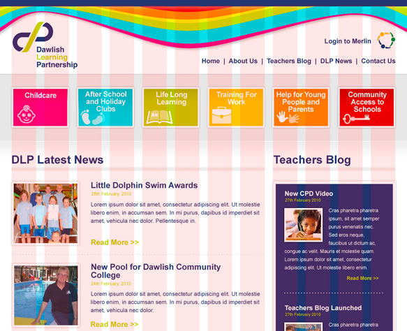
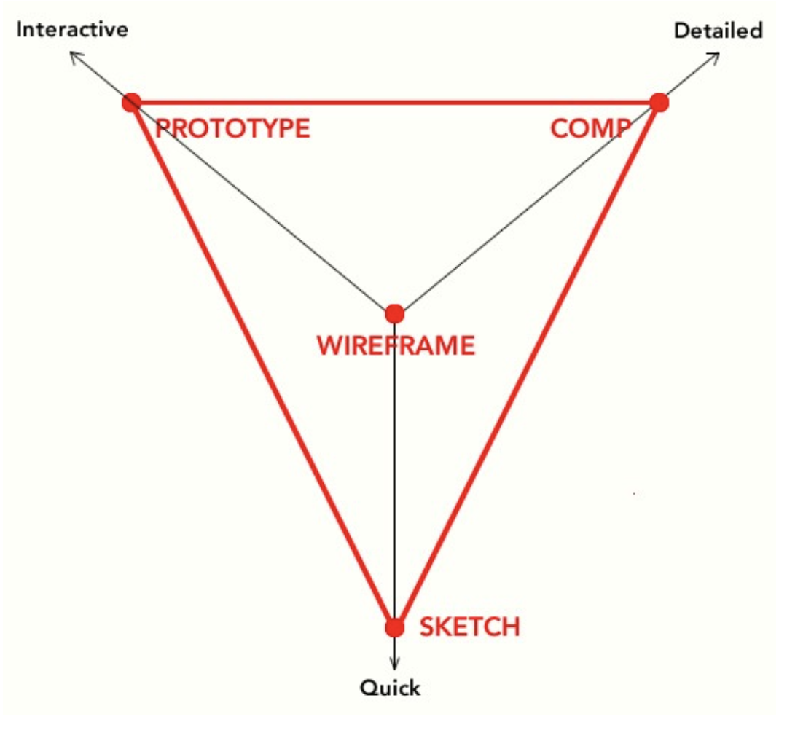

# Wireframes

A PDF of slide deck is [in this repo](docs/2.5-WebLayoutandWires.pdf).

## Takeaways

### CRAP

- Contrast
- Repetition
- Alignment
- Proximity

### Atomic Design

- Details [here](http://bradfrost.com/blog/post/atomic-web-design/).

### 12 Column Grid

### Wireframes

Wireframes should express:

- Design concept or intent
- Hierarchy of elements on a page
- Functionality
- Page layout
- Relative proportions of items
- Interactions

### Wireframing Resources

Low-Fi and Free:
- [Balsamiq](https://balsamiq.com/)
- [Mockingbird](https://gomockingbird.com/home)
- [Google Drawings](https://docs.google.com/drawings/)
- [Cacoo](https://cacoo.com/)

Industry Standards:
- [Sketch](https://www.sketchapp.com/)
- [Invision](https://www.invisionapp.com/)
- [Axure](https://www.axure.com/)
- [Photoshop](http://www.adobe.com/products/photoshop.html)
- [Illustrator](http://www.adobe.com/products/illustrator.html)

Lowest Fi:
- [Pencil/Paper](http://lmgtfy.com/?q=pencil+and+paper)
- [Microsoft Paint](https://youtu.be/hlnodEYZ71w)
- [Excel](https://products.office.com/en-us/excel)

### Tips for Getting Started

- Focus on what you need to communicate, and leave all other info out
- Keep it simple: black and white
- Justify every element on every interface
- Annotate as you go along
- Adopt things from other people’s wireframes to create your own style
- Focus on software that you’re comfortable with and become an expert

